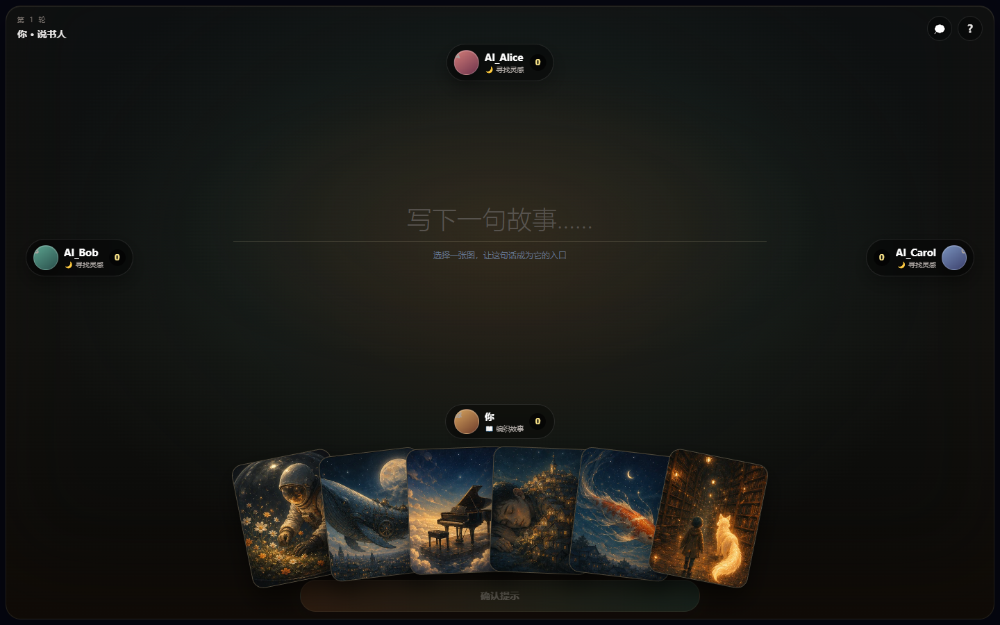

# DreamCards

**An AI-powered narrative card game framework for multiplayer social creativity.**

DreamCards is not only a playable image-association game. It is an open framework for building narrative systems in which official art, player uploads, and AI-generated cards enter the same governed content lifecycle, then become prompts for hidden-information play, voting, replay, collection, and community storytelling.

[](https://github.com/pumpkin-ops/DreamCards/actions/workflows/ci.yml)
[](LICENSE)
[](https://dreamcards-psi.vercel.app)

[Live Demo](https://dreamcards-psi.vercel.app) · [Architecture](docs/architecture.md) · [API](docs/api.md) · [Roadmap](docs/roadmap.md) · [Contributing](CONTRIBUTING.md)



> Gameplay GIF placeholder: `assets/demo.gif`. A reproducible recording script is planned before the first tagged beta.

## Features

- **AI-generated narrative cards** from text, image, or hybrid prompts through a provider-neutral pipeline.
- **Multi-source card system** for official, user-uploaded, and AI-generated content with durable provenance.
- **Hidden information and voting mechanics** backed by reusable scoring and vote-validation rules.
- **Replay and review system** for vote flow, unused inspiration drafts, and post-round interpretation.
- **Player-generated content ecosystem** connecting discovery, collection, curation, play, and redistribution.
- **Multimodal AI players** for clue generation, card selection, and voting.
- **Deterministic fallback behavior** when a model times out, rate-limits, fails validation, or is not configured.
- **Moderation-first boundaries** for upload validation, prompt filtering, risk scoring, review, and rejection.
- **Single-player and multiplayer orchestration** using the same framework-independent game rules.

## Architecture

```text
┌──────────────────────────── Client ────────────────────────────┐
│ React table UI · collections · replay · matchmaking           │
└───────────────────────────────┬────────────────────────────────┘
                                │ commands / snapshots
┌───────────────────────────────▼────────────────────────────────┐
│ backend/  HTTP API · auth · session orchestration             │
├──────────────────────┬──────────────────────┬──────────────────┤
│ core/                │ ai/                  │ realtime adapter │
│ game engine          │ generation pipeline │ polling today    │
│ state machine        │ prompts + fallback  │ WebSocket later  │
└──────────┬───────────┴──────────┬───────────┴────────┬─────────┘
           │                      │                    │
┌──────────▼───────────┐  ┌───────▼──────────┐  ┌──────▼─────────┐
│ moderation layer    │  │ model providers  │  │ storage layer  │
│ allow/review/reject │  │ untrusted output │  │ SQLite + files │
└─────────────────────┘  └──────────────────┘  └────────────────┘
```

The backend is authoritative for hidden information. AI output is never authoritative: it is parsed, validated, constrained by `core/`, and replaced locally when unavailable.

## Repository Layout

| Path | Ownership |
| --- | --- |
| `frontend/` | React UI and client-side interaction state |
| `backend/` | Express transport, auth, storage adapters, rooms, and orchestration |
| `core/game-engine/` | Scoring, vote constraints, win conditions, and reusable game rules |
| `core/state-machine/` | Legal phases and round transitions |
| `ai/generation/` | Text/image/hybrid generation pipeline and provider contract |
| `ai/prompts/` | Versionable prompt construction |
| `ai/fallback/` | Rule-based selection, tag similarity, and cached-card reuse |
| `ai/moderation/` | Upload validation, prompt filtering, safety score, review decisions |
| `docs/` | Architecture, API, safety, roadmap, and design records |
| `examples/` | Provider and integration examples |
| `tests/` | Deterministic rules, state-machine, moderation, and AI fallback tests |
| `scripts/` | Simulation, repository automation, and label synchronization |
| `assets/` | Screenshots and documentation media |

See [architecture.md](docs/architecture.md) for the migration map and dependency rules.

## Getting Started

### Requirements

- Node.js 22+
- npm 10+

```bash
git clone https://github.com/pumpkin-ops/DreamCards.git
cd DreamCards
npm install
cp .env.example .env
npm run dev
```

PowerShell:

```powershell
Copy-Item .env.example .env
npm run dev
```

- Frontend: `http://localhost:5173`
- API health: `http://localhost:4000/api/health`
- Live demo: https://dreamcards-psi.vercel.app

No model key is required. Without a configured provider, the framework uses deterministic local behavior.

### Verify a contribution

```bash
npm run lint
npm test
npm run build
npm run check
```

## AI Card Pipeline

```text
text prompt / image prompt / hybrid prompt
                       |
                 prompt filter
                       |
                provider adapter
                       |
          image + narrative + tags + risk
                       |
            moderation decision
              /        |        \
           allow     review     reject
             |          |          |
          publish    quarantine   fallback
```

Stable endpoints:

- `POST /api/ai/generate-card`
- `POST /api/ai/moderate`
- `POST /api/ai/fallback`

See [API documentation](docs/api.md).

## Why Open Source

AI-assisted UGC systems face a content explosion problem: creation becomes cheap while provenance, moderation, appeals, discovery fairness, storage, and community governance become more expensive. Narrative games add another research surface because one image must remain interpretable, safe, anonymous during play, attributable outside play, and reusable across many social contexts.

DreamCards makes those boundaries inspectable. The reusable game engine exposes hidden-information and scoring rules; the AI layer demonstrates provider-independent validation and degradation; the content model separates gameplay secrecy from creator provenance; and multiplayer orchestration provides a concrete environment for studying mixed human/AI interaction. Open development allows game designers, safety engineers, AI developers, and community maintainers to test these decisions together instead of rebuilding isolated prototypes.

## Codex Integration

Codex can support the project without becoming an unreviewed maintainer:

- **PR review:** compare changes against `AGENTS.md`, architecture boundaries, hidden-information rules, and moderation requirements.
- **Bug triage:** translate reports into minimal state-machine reproductions and regression tests.
- **Test generation:** produce edge-case fixtures for scoring, duplicate actions, reconnects, malformed model output, and policy changes.
- **Moderation support:** convert policy revisions into test matrices, review schema consistency, and flag missing audit paths.
- **Documentation maintenance:** identify API or environment changes that require synchronized docs and examples.

Human maintainers remain accountable for merge decisions, safety policy, licenses, and final moderation outcomes.

## Contributing

Read [CONTRIBUTING.md](CONTRIBUTING.md) before opening a PR. AI-assisted contributions are welcome when disclosed and reviewed. Never submit credentials, private user content, unlicensed card art, or model output that has bypassed moderation.

Suggested labels include `ai`, `game-core`, `ui`, `bug`, `enhancement`, and `moderation`.

## Security and Governance

- Vulnerabilities: [SECURITY.md](SECURITY.md)
- Community conduct: [CODE_OF_CONDUCT.md](CODE_OF_CONDUCT.md)
- Decision process: [GOVERNANCE.md](GOVERNANCE.md)
- Funding/support justification: [PROJECT_JUSTIFICATION.md](PROJECT_JUSTIFICATION.md)

## Status

DreamCards is a playable framework prototype. SQLite, filesystem uploads, in-memory rooms, and short polling are development adapters, not claims of production scale. The roadmap prioritizes authoritative realtime rooms, reconnect snapshots, complete moderation workflows, provider adapters, and public evaluation fixtures.

## License

[MIT License](LICENSE). DreamCards contains original rules and assets and does not distribute Dixit trademarks or official artwork.
