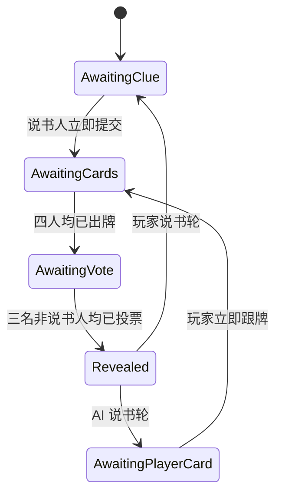

# DreamCards 系统策划作品集

> 陈铭｜游戏系统策划（校招）  
> 独立系统策划 / 原型负责人｜Demo 0.1｜2026.06

---

## P1｜封面：让玩家共同创造梦境卡牌世界

### 核心命题

DreamCards 是一款四人图片联想叙事游戏。

我希望解决的不是“如何复刻一局联想桌游”，而是：

> 如何让玩家创造的图片，在收藏、策展、对局和讨论中持续产生新的价值？

### 本项目重点验证

- UGC 图片如何成为长期内容资产；
- 主观联想如何形成公平、可控的规则博弈；
- AI 如何在遵守玩家规则的前提下参与说书、跟牌和投票；
- 外部模型不稳定时，实时对局如何继续推进。

### 页面主视觉

**建议图片：**牌桌全景截图，占页面约 65%；展示四人围桌、中央提示、匿名牌与玩家手牌。

---

## P2｜一图看懂：一张图片如何从创作进入对局

### 目的

用一张图说明 DreamCards 的内容、玩法和复盘并非独立功能。

### 系统全景

```text
玩家上传图片
      ↓
生成永久作品身份
      ↓
被发现与收藏
      ↓
加入主题梦境集
      ↓
进入四人联想对局
      ↓
产生提示、投票与联想记录
      ↓
回到收藏、复盘与作品传播
```

### 设计逻辑

传统联想桌游的图片通常是固定题库，对局结束后只留下分数。DreamCards 将作品、收藏、梦境集和回合记录串成同一条内容循环：

- **作品**提供对局内容；
- **对局**制造新的解释和曝光；
- **收藏**记录玩家偏好；
- **梦境集**表达玩家的策展主题；
- **复盘**保存图片与玩家之间的故事。

### 结论

对局是内容传播器，收藏和复盘是内容沉淀器。

### 页面主视觉

**必须增加：系统全景图。**  
采用环形资源循环，中心放置“图片作品”，外围为创作、发现、收藏、梦境集、对局、复盘。

---

## P3｜为什么做：联想结束后，图片价值去了哪里？

### 体验现象

固定图片联想玩法在单局内成立，但长期体验存在三个问题：

| 体验现象 | 机制归因 | 玩家影响 |
|---|---|---|
| 图片反复出现后新鲜感下降 | 内容供给固定 | 联想逐渐形成标准答案 |
| 结算后只保留分数 | 缺少内容沉淀 | 本轮表达迅速消失 |
| 玩家只能使用图片 | 内容生产与玩法分离 | 缺少创作者身份与长期目标 |

### 我考虑过的方案

**方案 A：持续扩充官方图库**

- 优点：质量和风格可控；
- 问题：供给成本持续增长，玩家仍然只是消费者。

**方案 B：允许玩家上传，但仅作为私人牌组**

- 优点：实现简单；
- 问题：内容无法跨玩家传播，缺少社区价值。

**最终方案：UGC 作品资产化**

- 每张作品拥有永久 ID、创作者和独立序号；
- 作品可被发现、收藏并加入其他玩家的梦境集；
- 对局传播不改变原始署名；
- 出场与收藏数据为后续创作者声望提供基础。

### 结论

UGC 的价值不只在“降低内容成本”，而在于让玩家同时成为创作者、收藏者和传播者。

### 页面主视觉

**建议图片：**作品详情、收藏页、梦境集页面三张局部截图，以“同一作品的传播路径”串联。

---

## P4｜为什么收藏不等于组牌：如何让 Meta 服务表达？

### 问题

若直接照搬竞技卡牌游戏的 Deck Building，玩家会关注效率、稀有度和最优组合，削弱 DreamCards 的图片联想与策展气质。

### 方案比较

| 方案 | 玩家目标 | 风险 |
|---|---|---|
| 竞技套牌 | 构造强度与胜率 | 图片被工具化 |
| 自动推荐牌组 | 降低选择成本 | 玩家表达空间不足 |
| 梦境集 | 围绕主题整理 10 张作品 | 需要更强的收藏与策展反馈 |

### 最终设计

梦境集不是战斗构筑，而是一个主题策展单元：

- 固定包含 10 张作品；
- 拥有封面、名称、简介和创建时间；
- 作品来源于玩家已收藏内容；
- 进入对局后与其他玩家的梦境集合并传播。

### 资源循环

```text
对局发现
→ 收藏作品
→ 建立主题梦境集
→ 携带进入新对局
→ 其他玩家再次发现
```

### 尚未验证

- 10 张是否足以表达主题；
- 梦境集封面和简介是否影响收藏转化；
- 玩家更在意单张作品还是完整主题；
- 作品传播是否会带来二次收藏。

### 页面主视觉

**必须增加：资源循环图。**  
配合一张梦境集详情截图，标出封面、简介与 10 张作品。

---

## P5｜为什么一局中每个角色都有事可做？

### 问题

如果说书人只负责描述、其他玩家只负责猜答案，回合会退化为单向问答。每种角色都必须拥有独立的风险与收益。

### 三条决策路径

#### 说书人

```text
观察 6 张手牌
→ 选择联想空间
→ 控制提示模糊度
→ 承担过直白或过模糊均不得分的风险
```

#### 跟牌者

```text
理解提示
→ 比较手牌关联程度
→ 选择合理但可能误导他人的图片
→ 争取诱导票
```

#### 投票者

```text
排除自己的牌
→ 比较提示与 3 张有效候选图
→ 判断说书人的表达方式
→ 提交唯一判断
```

### 风险收益

| 角色 | 风险 | 收益 |
|---|---|---|
| 说书人 | 所有人猜中或无人猜中 | 控制部分人猜中 |
| 跟牌者 | 图片缺少关联，无人受骗 | 每获一张诱导票加分 |
| 投票者 | 被干扰牌误导 | 猜中获得基础分 |

### 结论

玩家不是轮流完成步骤，而是在三个不同决策空间中争取收益。

### 页面主视觉

**必须增加：三角色决策路径图。**  
用三角结构连接说书人、跟牌者、投票者，并在边上标注提示、图片和投票的信息流。

---

## P6｜为什么答案会被泄露？

### 最初误判

早期版本为了让玩家快速识别说书人，在说书人的牌背上增加皇冠。

### 实际问题

皇冠附着在“牌”而不是“座位”上，相当于直接标记正确答案。除此之外，还有四类隐性泄露：

- 卡牌标题提前建立语义锚点；
- 后台标签暴露 AI 的判断依据；
- 创作者身份可能帮助熟悉作品的玩家反推归属；
- 投票目标实时公开会影响后续玩家选择。

### 根因

我最初把“信息是否需要展示”当作 UI 问题，而不是规则问题。推理游戏中，信息出现的 **时间、对象和粒度** 都会改变决策空间。

### 影响

```text
信息提前出现
→ 候选范围缩小
→ 玩家不再依赖图片联想
→ 推理公平性失效
```

### 结论

答案泄露不只来自明文答案。任何能稳定关联“图片—玩家—身份”的信息，都可能成为旁路提示。

### 页面主视觉

**建议图片：**皇冠牌背错误版本与统一牌背修正版本对照；用红线标出泄露路径。

---

## P7｜如何让玩家看见进度，却看不见答案？

### 设计目标

玩家必须知道牌桌是否仍在推进，但不能提前知道其他人的具体选择。

### 信息权限方案

| 阶段 | 必须公开 | 必须隐藏 |
|---|---|---|
| 手牌 | 自己的图片 | 他人手牌、后台标签 |
| 出牌中 | 谁已出牌 | 出了哪张 |
| 投票中 | 谁已投票 | 投给哪张 |
| 结算 | 图片归属、票流、得分 | 后台标签 |
| 复盘 | 主动公开的灵感 | 未公开私人草稿 |

### 为什么不是“全部隐藏”

全部隐藏虽然安全，但会产生新的问题：

- 玩家无法判断其他人是否已行动；
- AI 等待过程像页面卡死；
- 围桌体验退化为单人表单。

### 最终原则

> 行动状态可见，行动内容保密。

### 数据边界

- 对局阶段前端只获得当前阶段允许展示的数据；
- `voteStatus` 与具体 `votes` 分离；
- 创作者和作品序号只在对局外或结算后返回；
- 私人灵感默认不进入公开回合数据。

### 结论

信息权限矩阵同时服务公平性与实时感，两者不是互斥目标。

### 页面主视觉

**必须增加：信息流图。**  
以服务端为中心，分别画出手牌、提交状态、投票状态和揭晓数据在不同阶段的开放范围。

---

## P8｜为什么玩家提交后会卡住 20 秒？

### 最初方案

```text
玩家提交
→ AI_Alice 选择
→ AI_Bob 选择
→ AI_Carol 选择
→ 接口返回
→ 前端统一更新
```

### 测试现象

- 玩家提交提示后约 20 秒才进入下一阶段；
- 自己的牌背、手牌数量和状态均未变化；
- 不知道哪个 AI 已完成；
- 玩家可能重复点击，误以为页面失效。

### 最初分析偏差

第一反应是“模型响应太慢”。但即使模型耗时无法继续压缩，玩家自己的行为也不应等待其他参与者才生效。

### 根因

系统错误地把：

> “所有人完成”

当成：

> “任何人的行为生效”

### 备选方案

| 方案 | 优点 | 问题 |
|---|---|---|
| 继续压缩 Prompt | 改动小 | 无法消除网络波动 |
| 统一加载动画 | 能解释等待 | 玩家状态仍被阻塞 |
| AI 行为全部预计算 | 体验快 | 无法覆盖动态提示与手牌 |
| 逐玩家异步状态 | 行为立即反馈 | 状态管理复杂度增加 |

### 结论

这是状态模型问题，不是单纯性能问题。

### 页面主视觉

**必须增加：旧流程时序图。**  
用 20 秒时间轴显示玩家操作被三个串行 AI 请求阻塞。

---

## P9｜如何把同步表单重构为实时牌桌？

### 最终方案

新增 `AwaitingCards`，把“等待其他玩家”变成正式回合状态：



### 状态迁移逻辑

1. 玩家提交立即写入回合；
2. 手牌立即移入弃牌堆；
3. 座位立即显示统一牌背；
4. 多名 AI 并行执行；
5. 每完成一名 AI，独立更新其座位状态；
6. 满足人数条件后自动迁移。

### 为什么选择逐玩家状态

- 符合多人实时游戏的反馈粒度；
- 慢 AI 不会遮蔽已完成玩家；
- 玩家不再依赖“揭晓”按钮等待所有人；
- 出牌和投票可使用同一套状态原则。

### 当前限制

Demo 使用 500ms 短轮询同步状态。真实多人版本需要改为 WebSocket，并增加断线重连、服务端计时和幂等请求。

### 结论

状态机重构没有让模型本身变快，但让玩家操作从约 20 秒等待降至 `1–3ms` 即时反馈。

### 页面主视觉

**必须增加：新旧流程对比图。**  
左侧串行流程，右侧玩家即时返回、AI 并行更新；下方放状态机图。

---

## P10｜为什么说书人不能让所有人都猜中？

### 数值目标

提示必须“可理解但不明显”。若只奖励猜中，最优策略会变成直接描述图片；若只奖励无人猜中，提示会变成私人暗号。

### 计分规则

设非说书人数 `N = 3`，猜中人数为 `C`：

| 条件 | 说书人 | 猜中者 | 未猜中者 |
|---|---:|---:|---:|
| `C = 0` | 0 | — | +2 |
| `C = 3` | 0 | +2 | — |
| `0 < C < 3` | +3 | +3 | 0 |

附加规则：

- 非说书人的图片每获得 1 票，提交者额外获得 1 分；
- 玩家不能投自己的图片；
- 说书人不参与投票。

### 风险收益逻辑

- `C=0`：提示过度模糊，说书人承担失败；
- `C=3`：提示过度直白，说书人同样失败；
- `C=1 或 2`：提示处于目标区间；
- 诱导票让跟牌者不只是“陪跑”，而是主动争取误导收益。

### 极端情况

- 诱导票在 4 人局中的相对价值较高，可能超过部分基础得分；
- 熟人局会因表达习惯被学习而提高猜中率；
- 不同 AI 模型可能形成稳定的提示难度差异；
- 当前尚无长局数据证明分差不会快速扩大。

### 验证指标

- `C=0/1/2/3` 的实际分布；
- 基础分与诱导分占比；
- 各模型平均猜中人数；
- 提示长度与猜中率相关性；
- 分差随轮数变化。

### 页面主视觉

**必须增加：计分收益曲线。**  
横轴为猜中人数 `C`，纵轴为说书人收益；突出中间区间为唯一正收益。

---

## P11｜为什么不能直接相信 AI 的答案？

### 问题

模型能够理解图片，不代表它天然理解游戏目标，也不代表返回结果合法。

### AI 的三种玩家行为

| 行为 | 目标 | 规则约束 |
|---|---|---|
| 说书 | 生成可联想但不直白的提示 | 避免主体、颜色、数量和明显动作 |
| 跟牌 | 选择合理关联且具有干扰性的图片 | 只能从自身手牌选择 |
| 投票 | 判断最可能的说书人图片 | 必须排除自己的牌 |

### 提示设计

目标从“准确描述图片”改为“控制猜中人数”：

- 输出 2–10 个汉字；
- 优先情绪、记忆、隐喻、反差与时间感；
- 禁止直接复述主体或场景；
- 设计目标为 3 名猜测者中约 1–2 人猜中。

### 合法性校验

```text
模型返回
→ 提取 JSON
→ 校验字段结构
→ 校验 cardId 属于候选集合
→ 校验没有选择自己的牌
→ 无效则进入本地降级
```

### 为什么保留本地策略

游戏系统需要保证“行为一定发生”，而不是保证“模型一定成功”。本地策略质量可以较低，但必须合法、有限时并能推进回合。

### 结论

模型负责提出判断，系统负责定义目标、权限和合法性。

### 页面主视觉

**必须增加：AI 决策漏斗图。**  
展示视觉输入、模型判断、结构化输出、规则校验和降级选择。

---

## P12｜如果一个 AI 50 秒不返回，整局怎么办？

### 失败案例

一次实际测试中：

- AI_Alice 已完成投票；
- AI_Bob 已完成投票；
- AI_Carol 超过 50 秒仍处于“判断中”；
- 回合无法自动揭晓。

### 根因

早期只处理“请求报错后 fallback”，没有处理“请求始终不结束”。没有硬超时的 fallback 不是完整容错。

### 最终异常策略

```text
AI_TIMEOUT_MS = 9000
```

| 异常 | 处理 | 失败粒度 |
|---|---|---|
| 超过 9 秒 | 本地策略 | 一名 AI 的一次行为 |
| JSON 错误 | 尝试提取，失败则降级 | 当前返回 |
| 无效 cardId | 从有效集合选择 | 当前决策 |
| 图片读取失败 | 使用可用信息降级 | 当前图片 |
| API Key 缺失 | 全局本地人机模式 | AI 服务 |

### 边界条件

- 说书人请求不能进入投票接口；
- 非说书人不能选择自身提交牌；
- 重复提交不能重复扣牌；
- 当前阶段之外的操作必须拒绝；
- 一个 AI 降级不能覆盖其他 AI 已完成结果；
- 全部必要行为完成后才允许结算。

### 结论

AI 的失败粒度必须被限制为“一名玩家的一次行为”，不能扩散为整个房间的失败。

### 页面主视觉

**必须增加：异常决策树。**  
从正常返回、超时、解析失败、无效 ID、缺图分支到合法行为结果。

---

## P13｜设计失误与迭代：哪些方案看似合理却破坏体验？

### 目的

集中展示失败方案、根因判断和规则层修正。

| 最初方案 | 暴露的问题 | 根因 | 修改 | 结果 |
|---|---|---|---|---|
| 等待全部 AI 后统一返回 | 玩家约 20 秒无反馈 | 状态单位错误 | 逐玩家异步状态 | 提交 `1–3ms` 返回 |
| 说书人牌背显示皇冠 | 直接泄露答案 | 身份标识绑定答案对象 | 皇冠只留在座位 | 所有牌背一致 |
| 默认显示 AI 出牌与投票理由 | 结算像调试界面 | 调试信息与玩家信息混用 | 理由移入详细复盘 | 默认结算只保留图、票流、分差 |
| 各梦境集独立洗牌 | 两人可能持有同图 | 缺少全局牌池约束 | 全局分配器双重去重 | 40/40 唯一 |
| 出牌只写提交记录 | 手牌不会减少 | 提交与资源迁移分离 | 同步移入弃牌堆并补牌 | 手牌循环闭环 |
| API 报错才 fallback | 慢请求永久阻塞 | 缺少时间边界 | 9 秒硬超时 | 最慢约 8.9 秒推进 |

### 共同教训

这些问题表面分别属于性能、UI、数据和 AI，实际都来自同一类设计缺陷：

> 没有把体验要求转化为状态、权限和边界约束。

### 页面主视觉

**建议图片：**选择其中 3 个问题做 Before / After 截图；其余保留精简表格。

---

## P14｜如何验证规则真的成立？

### 测试目标

验证的不是“按钮能否点击”，而是四个系统假设：

1. 玩家行为是否即时生效；
2. 信息是否按阶段正确开放；
3. 异常是否被隔离；
4. 资源与计分是否能够完成循环。

### 测试结构

| 测试类型 | 方法 | 目标 |
|---|---|---|
| 功能测试 | 玩家和 AI 分别担任说书人 | 核心流程闭环 |
| 时序测试 | 记录提交、状态变化和揭晓耗时 | 验证异步反馈 |
| 权限测试 | 对比不同阶段公开数据 | 验证答案保密 |
| 异常测试 | 慢模型、错误 JSON、缺图 | 验证局部降级 |
| 数据测试 | 检查 ID 与图片地址 | 验证全局唯一 |
| 构建测试 | 前后端正式构建与健康检查 | 验证展示稳定性 |

### 关键规则用例

- 说书人不能投票；
- 玩家不能投自己；
- 牌背不能标记说书人答案；
- 投票前不能公开目标；
- 已行动玩家必须立即更新；
- AI 超时后对局必须继续；
- 出牌必须消耗手牌；
- 牌库耗尽必须洗回弃牌堆。

### 未覆盖范围

- 多设备真实网络延迟；
- 四名真人完整联网对局；
- 断线重连与服务端恢复；
- 大样本提示难度和长局平衡；
- 大规模用户可用性测试。

### 页面主视觉

**必须增加：测试矩阵图。**  
横轴为阶段，纵轴为功能、权限、异常、数据；用勾选标记覆盖情况。

---

## P15｜数据结果：修改是否真的有效？

### 时序结果

| 场景 | 修改前 | 修改后 |
|---|---:|---:|
| 玩家说书并提交 | 约 20 秒后反馈 | `3ms` 返回 |
| AI 说书轮玩家跟牌 | 等待其他 AI | `1ms` 返回 |
| 最慢完整自动揭晓 | 可能超过 50 秒并卡死 | `8943ms` |
| 单个 AI 最大等待 | 无上限 | `9000ms` |

### 唯一性结果

```text
总牌数：40
唯一 cardId：40
唯一图片：40
重复 ID：0
重复图片：0
```

### 规则结果

已验证 11 项关键规则，包括：

- 说书人不投票；
- 禁止自投；
- 投票目标保密；
- 牌背一致；
- 玩家行为即时显示；
- 超时自动降级；
- 手牌消耗与弃牌洗回。

### 结果边界

这些数据证明：

- 核心流程可运行；
- 玩家不再被其他 AI 同步阻塞；
- 单个模型异常不会永久卡局；
- 当前 40 张牌池不存在重复。

这些数据不能证明：

- 长局计分已经平衡；
- AI 提示难度长期稳定；
- 真实多人网络体验成立；
- UGC 内容循环具有长期留存效果。

### 页面主视觉

**必须增加：前后对比柱状图。**  
重点展示约 20 秒到 1–3ms 的提交反馈变化；另配 40/40 唯一性数据卡。

---

## P16｜最终系统如何把内容、规则与 AI 连接起来？

### 最终结构

```text
内容层
作品身份 → 图鉴/收藏 → 梦境集 → 对局牌池

玩法层
说书 → 跟牌 → 匿名展示 → 投票 → 计分 → 补牌

规则层
状态机 → 信息权限 → 全局去重 → 异常校验

AI 层
视觉理解 → 行为目标 → 结果校验 → 超时降级

沉淀层
回合记录 → 灵感草稿 → 复盘 → 传播数据
```

### 五层之间的关系

- 内容层提供可传播的作品；
- 玩法层制造联想和玩家行为；
- 规则层保证公平与流程一致；
- AI 层填充单人模式中的其他席位；
- 沉淀层将一次性行为转化为长期内容。

### 当前成立的体验

- 玩家始终停留在同一张围桌界面；
- 图片是对局中的主要信息；
- 每名玩家完成行动后立即产生桌面反馈；
- 提交内容和投票目标在揭晓前保持匿名；
- 结算后能够理解归属、票流和得分；
- 对局中发现的作品可进入收藏与梦境集。

### 页面主视觉

**必须增加：最终系统架构图。**  
五层结构用箭头连接，右侧放最终牌桌截图作为体验结果。

---

## P17｜下一步最应该验证什么？

### 判断原则

下一阶段不继续堆功能，优先验证当前系统中风险最高、证据最弱的假设。

### P0｜规则与稳定性

- 连续完成 8 轮，覆盖四名说书人各两次；
- 覆盖 `C=0/1/2/3` 全部计分分支；
- 验证弃牌堆首次洗回后的卡牌唯一性；
- 自动化覆盖提交、投票、结算与补牌。

### P1｜AI 与数值

- 每个视觉模型执行 30 次选择；
- 记录 P50、P90、P95 延迟与降级比例；
- 统计各模型提示的猜中人数分布；
- 对比基础分与诱导分占比。

### P2｜用户理解

邀请 5–8 名目标用户完成：

- 无说明开局；
- 完成一轮；
- 解释计分原因；
- 使用灵感草稿；
- 进入复盘。

记录首次开局耗时、规则理解错误、重复点击、结算理解耗时与复盘进入率。

### P3｜真实多人

- WebSocket 状态推送；
- 服务端权威计时与结算；
- 断线重连、掉线托管和幂等提交；
- 房间级日志和异常恢复。

### P4｜UGC 内容生态

- 图片审核与举报；
- 收藏转化率；
- 梦境集收藏与推荐；
- 作品进入对局后的二次收藏；
- 创作者声望与传播路径。

### 页面主视觉

**必须增加：验证路线图。**  
以“规则成立 → AI稳定 → 用户理解 → 真人联网 → 内容生态”为五阶段，而不是普通开发甘特图。

---

## P18｜反思：这次项目真正改变了我的哪些设计判断？

### 判断一：实时体验不是加载速度，而是行为是否被承认

模型仍可能需要数秒完成，但玩家自己的提交不应因此失效。逐玩家状态比统一接口返回更接近真实多人游戏。

### 判断二：信息隐藏不是越多越好

全部隐藏会让牌桌失去进度感；全部公开会破坏推理。有效方案是公开行动状态，同时隐藏行动内容。

### 判断三：AI 接入首先是规则问题

模型能力只能决定候选质量，不能决定行为是否合法。游戏仍需要明确目标、候选范围、超时和降级。

### 判断四：数值规则必须对应玩家策略

三分支计分的价值不在数字本身，而在于让说书人避免两个极端，让跟牌者主动制造合理干扰。

### 判断五：UGC 系统的难点不是上传

真正需要设计的是作品身份、传播路径、收藏关系、对局使用和创作者权益如何形成闭环。

### 仍未解决的问题

- 当前数据不足以判断长期数值平衡；
- 单人 AI 行为不能替代真人社交验证；
- 作品传播与收藏循环尚未经过留存数据验证；
- 真实多人需要重新设计权威状态、断线与作弊边界。

### 最终结论

> 系统策划的工作不是把功能连接起来，而是把玩家目标、规则激励、信息边界和异常结果连接起来，并用验证证明这些关系确实成立。

### 页面主视觉

**建议图片：**最终牌桌与复盘室双图；仅保留上述五条判断作为页面文字。

---

# 页面编辑清单

## 应删除的旧页

- 删除原“项目背景”与“问题定义”两页的重复市场描述，合并为新版 P3。
- 删除单纯罗列用户类型的页面，将用户需求融入 P3、P4。
- 删除独立“回合规则”页，规则分别放入玩家决策、计分、边界页面。
- 删除纯“随机与概率”页，将抽牌概率与重复风险纳入 P10、P17 的验证计划。
- 删除独立“AI 服务质量”说明页，与 AI 合法性和异常案例合并为 P11、P12。
- 删除流水账式三页迭代记录，集中为 P13《设计失误与迭代》。
- 删除竞品分析附录；两份分析报告作为独立作品集附件，不占 DreamCards 主项目叙事。

## 应合并的旧页

- “产品结构”与“UGC/梦境集”合并为 P2–P4。
- “信息流”与“信息权限”合并为 P6–P7。
- “同步问题”与“状态机重构”组成连续的 P8–P9。
- “数值目标”与“极端票型”合并为 P10。
- “异常流程”“AI 超时”“规则边界”合并为 P12。
- “验证方案”与“测试结果”拆成相邻的 P14–P15，形成方法与证据对应。

## 必须增加图片的页面

- P1：最终牌桌全景；
- P3：作品传播路径截图；
- P4：梦境集页面；
- P6：皇冠牌背 Before / After；
- P13：至少 3 组设计失误对照；
- P16：最终牌桌；
- P18：牌桌与复盘室。

## 必须增加图表的页面

- P2：系统全景图；
- P4：UGC 资源循环图；
- P5：三角色决策路径图；
- P7：信息权限与数据流图；
- P8：旧版串行时序图；
- P9：新旧流程与状态机对比；
- P10：说书人计分收益曲线；
- P11：AI 决策漏斗；
- P12：异常处理决策树；
- P14：测试覆盖矩阵；
- P15：时延前后对比图；
- P16：五层系统架构图；
- P17：验证路线图。

## 必须重点展示的失败案例

1. 同步 AI 流程导致约 20 秒无反馈；
2. 皇冠牌背直接泄露答案；
3. AI 理由默认展示造成结算信息过载；
4. 梦境集独立洗牌导致重复卡牌；
5. 出牌与牌区迁移分离导致手牌不消耗；
6. 无硬超时导致单个 AI 超过 50 秒阻塞整局。
