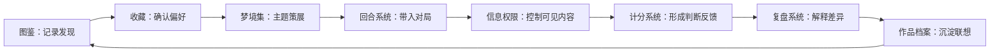
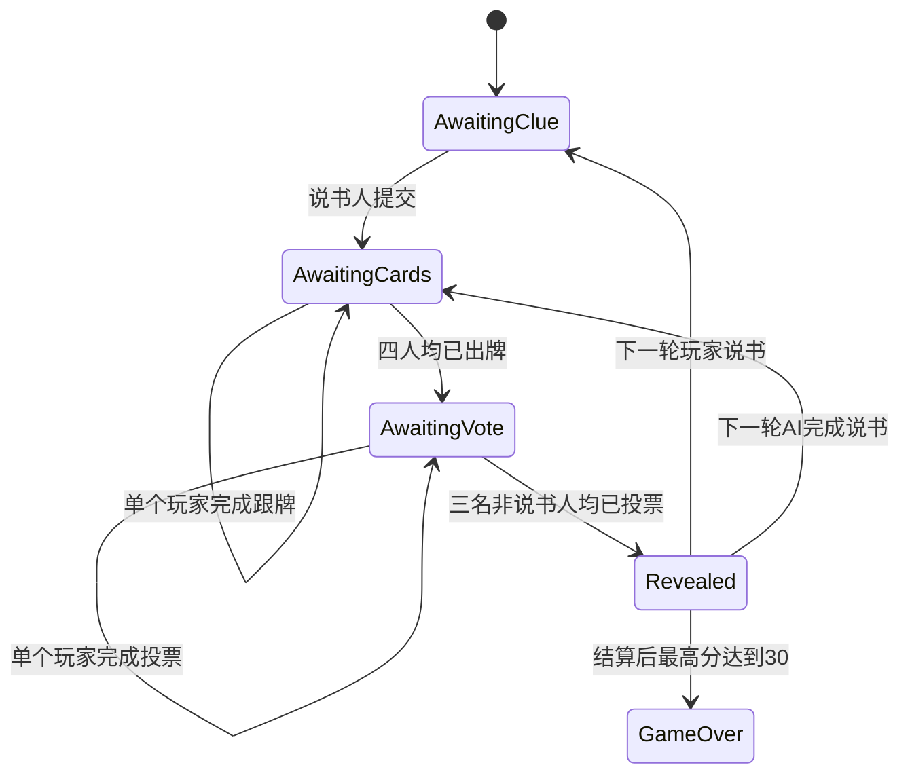

# DreamCards 系统分析报告

> 报告类型：游戏系统分析与迭代验证  
> 分析版本：DreamCards Demo 0.1  
> 目标岗位：游戏系统策划 / 玩法策划  
> 分析重点：系统结构、规则约束、状态机、信息权限、AI 行为与测试闭环

---

## 1. 分析对象

本报告以 DreamCards Demo 0.1 为分析对象。

DreamCards 是一款四人图片联想叙事桌游。其基础规则并不复杂，但要将线下桌游体验转化为可持续运行的线上系统，需要同时处理回合推进、隐藏信息、AI 不确定性、卡牌资源流转和 UGC 内容传播等问题。

本报告不重复介绍完整玩法，而是分析以下核心系统：

- **回合系统**：组织说书、跟牌、投票、结算、补牌与说书人轮换。
- **状态机**：区分个人行为完成与全局阶段推进，保证实时反馈。
- **计分系统**：通过三种票型控制提示词的风险收益。
- **AI 玩家系统**：约束 AI 的说书、跟牌和投票行为，并处理外部服务异常。
- **信息权限系统**：按阶段控制图片归属、投票目标、作品身份与灵感内容。
- **卡牌内容系统**：维护图片唯一性、创作者署名和作品传播数据。
- **图鉴、收藏与梦境集系统**：建立发现、收藏、策展和对局传播链路。
- **灵感与复盘系统**：降低等待空白，并沉淀玩家的联想过程。

分析目标是回答：

1. 各系统分别解决什么问题？
2. 系统之间通过哪些状态、资源和信息发生连接？
3. 早期方案为什么产生体验问题？
4. 调整方案如何被测试验证？
5. 当前版本还存在哪些风险？

---

## 2. 核心系统拆解

| 系统名称 | 功能目标 | 玩家价值 | 策划关注点 | 当前状态 |
| --- | --- | --- | --- | --- |
| 回合系统 | 组织四人说书、跟牌、投票与结算 | 获得稳定、可理解的对局节奏 | 阶段顺序、角色轮换、合法操作、异常推进 | 核心流程可完整运行 |
| 状态机 | 管理个人行为状态与全局阶段条件 | 操作后立即获得反馈 | 状态粒度、并发行为、重复提交、阶段锁定 | 已改为逐玩家异步状态 |
| 计分系统 | 约束提示清晰度并奖励误导 | 形成说书、猜测和干扰三类决策 | 三种票型、误导分、终局门槛、极端结果 | 规则已实现，长期平衡待验证 |
| 梦境集系统 | 将 10 张作品组织为主题内容单元 | 表达审美并控制带入对局的内容 | 容量限制、作品唯一性、主题表达、选择压力 | 基础创建与选择已实现 |
| 图鉴收藏系统 | 记录发现并保存偏好作品 | 建立对局外长期目标 | 发现与收藏边界、信息密度、转化路径 | 基础数据链路已建立 |
| AI 玩家系统 | 让三名 AI 完成说书、跟牌和投票 | 无真人房间时仍可完整游玩 | 视觉理解、提示难度、合法性、超时与降级 | 三类行为可运行，质量持续验证 |
| 灵感草稿系统 | 允许玩家提前记录卡牌联想 | 减少等待并沉淀创作过程 | 卡牌绑定、隐私权限、复盘公开 | 基础交互已建立 |
| 复盘室系统 | 还原图片归属、票流和理解差异 | 将结算转化为讨论和内容沉淀 | 信息组织、公开范围、讨论上下文 | 本地模拟版本已建立 |
| 信息权限系统 | 控制不同阶段可见内容 | 保护匿名推理和个人隐私 | 身份泄露、票型泄露、创作者权益 | 已形成阶段权限矩阵 |
| 卡牌内容系统 | 维护作品身份、唯一性与传播记录 | 确保图片可被发现、收藏和追溯 | 重复作品、署名连续性、资源完整性 | 40 张牌池唯一性已验证 |

### 2.1 系统关系

DreamCards 的系统不是并列功能列表，而是一组前后依赖关系：



回合系统负责产生一次体验，内容系统负责让这次体验留下可积累的结果。若两者分离，游戏会退化为一次性桌游原型，图鉴与收藏也会退化为独立的图片管理功能。

---

## 3. 核心循环分析

### 3.1 单局循环

```text
选择梦境集
    ↓
说书人选图并给出提示
    ↓
其他玩家跟牌
    ↓
匿名展示
    ↓
非说书人投票
    ↓
结算得分
    ↓
消耗卡牌并补牌
    ↓
轮换说书人
```

单局循环的主要价值是持续制造三种判断：

- 说书人判断提示应该公开多少信息；
- 跟牌者判断哪张图片能够形成合理误导；
- 投票者判断提示与候选图片之间的真实联系。

补牌和说书人轮换承担两个系统作用：

1. 更新玩家的决策环境，避免同一手牌长期停滞；
2. 让所有玩家依次经历表达者和判断者两种角色。

### 3.2 长期循环

```text
创作作品
    ↓
被其他玩家发现
    ↓
被收藏
    ↓
进入主题梦境集
    ↓
在对局中传播
    ↓
产生提示、误读与故事
    ↓
沉淀到复盘和作品档案
    ↓
形成新的创作与收藏动机
```

### 3.3 两个循环的连接方式

| 单局行为 | 产生的数据 | 长期系统承接 |
| --- | --- | --- |
| 玩家看到陌生图片 | 发现记录 | 图鉴 |
| 玩家认可某张图片 | 收藏意愿 | 收藏系统 |
| 图片被带入对局 | 出场记录 | 作品档案 |
| 玩家为图片生成提示 | 一句话联想 | 灵感与档案馆 |
| 玩家被图片误导 | 投票关系 | 复盘室 |
| 玩家喜欢一组图片 | 主题组织意愿 | 梦境集 |

单局循环为长期循环生产内容，长期循环又为下一局提供新的图片组合。两者形成正向关系的前提是：每次对局产生的发现、联想和传播记录能够被系统保留。

当前风险在于，长期循环中的收藏转化、梦境集创建和作品二次传播尚未经过真实用户规模验证。现阶段只能确认结构闭环成立，不能直接推断其留存效果。

---

## 4. 状态机分析

### 4.1 早期问题

早期流程将“玩家提交”和“AI 全部完成”绑定在一次同步等待中：

```text
玩家提交
    ↓
等待 AI_Alice
    ↓
等待 AI_Bob
    ↓
等待 AI_Carol
    ↓
统一返回并更新牌桌
```

实测中，玩家提交提示后约 20 秒没有可见反馈。虽然玩家已经完成操作，但手牌未消耗、牌背未出现、状态未改变。

### 4.2 问题影响

| 问题表现 | 玩家影响 | 系统风险 |
| --- | --- | --- |
| 提交后长时间无反馈 | 感知页面卡死 | 重复点击与重复提交 |
| AI 状态统一更新 | 无法判断谁已经完成 | 围桌参与感缺失 |
| 单个模型响应过慢 | 全体玩家被迫等待 | 单点故障阻塞整轮 |
| 前端只等待最终结果 | 操作与反馈脱节 | 实时游戏退化为同步表单 |

问题根因不只是 AI 慢，而是状态单位划分错误。系统将“整组玩家全部完成”作为最小反馈单位，而没有承认单个玩家已经完成的行为。

### 4.3 状态机调整

调整后，将个人状态和全局阶段拆开：



新增核心阶段：

```text
awaiting_cards
```

该阶段允许不同玩家依次完成出牌，而不要求一次性获得全部结果。

### 4.4 逐玩家状态

每名玩家分别维护：

- 是否已出牌；
- 是否正在思考；
- 是否已投票；
- 是否触发本地降级；
- 当前行为是否已经锁定。

阶段推进条件则单独判断：

| 阶段 | 个人反馈条件 | 全局推进条件 |
| --- | --- | --- |
| 出牌 | 任意玩家合法提交后立即更新 | 四名玩家均完成出牌 |
| 投票 | 任意非说书人合法投票后立即更新 | 三名非说书人均完成投票 |
| 结算 | 无个人输入 | 票池完整且计分完成 |

### 4.5 调整价值

这次重构建立了一个适用于真人联机和 AI 对局的共同原则：

> 玩家行为的反馈单位是单个玩家；回合推进的判断单位才是全体条件。

它解决的不只是响应时间，还包括：

- 谁已经行动的桌面可读性；
- 重复提交的状态锁定；
- 单个参与者异常时的局部处理；
- 真人联机后延迟差异的兼容能力。

---

## 5. 信息权限矩阵

联想推理玩法依赖不完全信息。错误公开任何一项身份线索，都可能让玩家绕过图片与提示，直接推断答案。

| 阶段 | 玩家可见信息 | 必须隐藏的信息 | 设计理由 |
| --- | --- | --- | --- |
| 手牌阶段 | 自己的 6 张图片、公开提示、玩家状态 | 他人手牌、后台标签、作品身份 | 保留个人决策空间，避免根据作品来源猜测 |
| 出牌中 | 谁已完成出牌、统一牌背 | 提交图片内容、提交顺序对应关系 | 提供桌面反馈，但不暴露候选牌归属 |
| 投票中 | 四张匿名图片、谁已完成投票 | 图片提交者、说书人真牌、具体投票目标 | 保持独立判断，防止跟票和身份推断 |
| 揭晓后 | 图片提交者、说书人真牌、投票流向、得分变化 | 后台标签、未公开私人草稿 | 解释规则结果，但避免无关数据干扰复盘 |
| 图鉴页 | 图片、创作者、作品编号、创建时间、传播数据 | 后台 AI 标签 | 保护创作者署名，同时不暴露内部判断依据 |
| 复盘室 | 回合提示、提交关系、票流、主动公开的灵感 | 玩家未授权公开的草稿与备注 | 支持讨论，同时保留创作隐私 |

### 5.1 权限错误案例

早期版本曾在说书人的牌背上显示皇冠。该表现原本用于强化角色识别，但实际结果是直接标记了真牌归属。

问题不在于皇冠图标本身，而在于角色信息被绑定到了匿名卡牌上。调整后：

- 说书人身份只显示在玩家座位；
- 四张提交牌使用完全一致的牌背；
- 皇冠只允许在揭晓后标记说书人真牌。

该案例说明，信息权限不能只在数据层定义，还必须覆盖颜色、动画、位置、图标和出现时机等表现信息。

### 5.2 权限设计结论

对局内外采用不同的信息公开规则：

- **对局内**优先保护匿名推理；
- **结算时**公开行为关系；
- **对局外**公开作品身份与创作者历史；
- **复盘时**由玩家决定是否公开创作过程。

这样既避免作品身份破坏推理，也不会因为匿名玩法而抹除创作者署名。

---

## 6. AI 系统分析

### 6.1 系统目标

AI 系统需要满足三项基本要求：

1. 能够直接理解图片并参与主观联想；
2. 遵守与真人相同的角色规则和信息权限；
3. 外部服务异常时不阻塞整局。

AI 的价值不在于给出唯一正确答案，而在于生成可被玩家理解、误判和讨论的联想行为。

### 6.2 行为输入、输出与约束

| 行为 | 输入 | 输出 | 关键约束 |
| --- | --- | --- | --- |
| 说书 | 说书人选择的图片 | 提示词 | 不直接描述主体；目标为约 1–2 人猜中 |
| 跟牌 | 提示词、当前手牌图片 | 提交卡牌 | 必须从合法手牌选择；关联合理但不能过于直白 |
| 投票 | 提示词、匿名候选图片、自己的卡牌标识 | 投票目标 | 不能选择自己的图片；只能选择合法候选 |

### 6.3 提示词控制

AI 说书容易出现两个极端：

- 直接描述画面主体，导致所有人猜中；
- 生成缺乏画面依据的抽象词，导致无人猜中。

因此提示生成目标不是“描述准确”，而是控制信息量。当前约束包括：

- 使用简短中文词语或短句；
- 避免直接说出人物、动物、物体、地点、颜色和数量；
- 优先使用情绪、记忆、时间感、反差与隐喻；
- 以三名猜测者中约 1–2 人猜中为目标。

该目标需要通过长期票型分布验证，不能仅凭提示文本主观判断。

### 6.4 异常分类与局部降级

| 异常 | 潜在影响 | 降级原则 |
| --- | --- | --- |
| 无 API Key | AI 行为无法请求 | 直接使用本地合法策略 |
| 请求失败 | 当前行为无结果 | 当前 AI 降级，不回滚其他玩家 |
| 429 限流 | 响应延迟或拒绝 | 终止等待并降级 |
| 超时 | 单个模型长期占用阶段 | 达到时限后强制进入本地策略 |
| JSON 错误 | 无法读取结构化选择 | 尝试提取有效内容，失败则降级 |
| 返回无效卡牌 | 破坏手牌或候选范围 | 从合法候选中重新选择 |
| 图片读取失败 | 模型无法获得视觉输入 | 当前行为使用本地信息完成 |

核心原则是：

> AI 失败的最小粒度是“某名 AI 的某一次行为”，不能扩大为整个回合失败。

### 6.5 9 秒上限

测试中曾出现一名 AI 超过 50 秒仍未返回，导致其他玩家已投票但无法揭晓。仅设置“请求失败后 fallback”无法覆盖连接长期不结束的情况。

因此当前单次 AI 行为设置 9 秒上限。超过上限后立即执行本地降级，使完整 AI 回合可以在约 9 秒边界内自动推进。

9 秒并不代表最终体验目标，而是 Demo 阶段在“模型表现质量”和“回合可继续”之间的保护上限。后续需要结合 P50、P90、P95 延迟重新设定。

### 6.6 AI 风格的后续方向

当前多模型方案主要用于观察视觉联想差异。后续可将行为风格抽象为稳定参数：

- 理性派：重视对象与空间关系；
- 诗人派：重视情绪与隐喻；
- 故事派：重视人物和事件推导。

只有当风格差异能够被玩家识别，并影响其投票判断时，该设计才具有实际玩法价值。否则不同模型只属于实现差异，不构成系统差异。

---

## 7. 计分系统分析

### 7.1 计分服务的决策

计分规则同时服务三个角色目标：

| 角色 | 核心决策 | 得分反馈 |
| --- | --- | --- |
| 说书人 | 控制提示的清晰度 | 部分玩家猜中时获得 3 分 |
| 猜测者 | 理解说书人的表达 | 猜中时获得对应基础分 |
| 跟牌者 | 制造合理干扰 | 每骗到一票获得 1 分 |

如果没有误导分，非说书人的最优策略可能退化为随意出牌；加入误导分后，跟牌本身也成为主动决策。

### 7.2 三种票型

| 票型 | 计分结果 | 系统含义 |
| --- | --- | --- |
| 全猜中 | 说书人 0 分，其他玩家各 +2 | 提示信息过量，缺少推理空间 |
| 全猜错 | 说书人 0 分，其他玩家各 +2 | 提示信息不足，联想无法建立 |
| 部分猜中 | 说书人 +3，猜中者 +3 | 提示在可理解与可误导之间达到平衡 |

此外，非说书人的图片每获得一票，提交者额外 +1 分。

### 7.3 为什么鼓励部分猜中

“部分猜中”同时满足：

- 提示与真牌之间存在可解释联系；
- 联系没有明确到排除其他候选；
- 跟牌图片有机会形成有效误导；
- 揭晓后不同玩家有可讨论的理解差异。

因此它不仅是计分上的最佳状态，也是社交讨论最可能发生的状态。

### 7.4 当前数据判断

10 局自动模拟共记录 113 轮：

| 票型 | 占比 |
| --- | ---: |
| 全猜中 | 3.54% |
| 全猜错 | 30.09% |
| 部分猜中 | 66.37% |

部分猜中占比最高，说明当前规则能够形成目标票型；但全猜错接近三成，可能意味着：

- AI 提示过于抽象；
- 跟牌图片的干扰强于真牌关联；
- 图片主题本身缺少共同语义；
- 不同 AI 的视觉理解标准差异较大。

现有数据来自自动模拟，只能用于验证规则分支和发现异常趋势，不能替代真人玩家对提示质量的评价。

---

## 8. 内容系统分析

### 8.1 取消卡牌名称

卡牌不只是“不显示名称”，而是在核心身份结构中取消标题字段。

设计原因：

- **避免语义锚点**：标题会提前限定图片解释方向。
- **保护开放解释**：同一图片应允许不同玩家产生不同联想。
- **避免标题作弊**：玩家不能通过名称与提示词的直接匹配判断答案。
- **降低信息污染**：投票依据集中在图片和提示，而非作品元数据。

### 8.2 保留的作品信息

取消标题不等于取消作品身份。系统仍保留：

- 创作者；
- 创作者作品序号；
- 创建时间；
- 出场次数；
- 收藏次数；
- 图片资源；
- 后台 AI 辅助标签。

作品以“创作者名 + 独立序号”建立稳定身份，例如 `Alice#7`。

### 8.3 对局内外规则差异

| 场景 | 展示内容 | 不展示内容 |
| --- | --- | --- |
| 手牌与投票 | 图片 | 创作者、编号、标签、传播数据 |
| 回合结算 | 图片、提交者、票流、得分 | 创作者、编号、后台标签 |
| 图鉴与收藏 | 图片、创作者、编号、时间、传播数据 | 后台标签 |
| 作品详情 | 完整作品历史和玩家公开内容 | 私人草稿 |

对局结算讨论的是“玩家与图片的关系”，作品详情讨论的是“创作者与作品的关系”。将两类信息分离，可以减少结算页的信息负担。

### 8.4 唯一性约束

早期版本按各自梦境集独立分配卡牌，导致不同玩家可能持有相同图片。该问题会破坏：

- 匿名候选的可信度；
- 玩家手牌的资源边界；
- 投票结果解释；
- 作品出场统计。

当前开局分配同时检查：

- 作品标识是否唯一；
- 标准化后的图片来源是否唯一。

验证结果为：

```text
总牌数：40
唯一作品标识：40
唯一图片：40
重复作品：0
重复图片：0
```

---

## 9. 梦境集系统分析

### 9.1 系统定位

梦境集不是以数值强度和克制关系为核心的竞技套牌，而是玩家组织图片主题的策展系统。

固定 10 张容量的作用是：

- 限制进入对局的内容规模；
- 降低开局前的选择压力；
- 促使玩家形成明确主题；
- 便于四人合并为 40 张可验证牌池；
- 为作品传播提供稳定单位。

### 9.2 玩家价值

| 价值 | 系统表现 |
| --- | --- |
| 审美表达 | 通过封面、名称、简介和作品组合形成主题 |
| 内容控制 | 玩家决定哪些作品进入公共对局 |
| 收藏整理 | 将分散收藏转化为有结构的集合 |
| 社交传播 | 其他玩家通过对局接触该梦境集中的作品 |

### 9.3 与图鉴、收藏的关系

```text
图鉴 = 我见过什么
收藏 = 我喜欢什么
梦境集 = 我如何组织并表达这些作品
```

三个系统应形成递进关系，而不是三个重复图片列表：

1. 对局触发发现；
2. 发现后由玩家主动收藏；
3. 收藏作品可以进入梦境集；
4. 梦境集将作品再次带入对局；
5. 新玩家由此完成下一次发现。

### 9.4 当前风险

- 图鉴与收藏边界若表达不清，会产生功能重复感；
- 梦境集信息过多可能重新变成素材管理器；
- 固定 10 张是否是最佳容量尚未经过真人测试；
- 玩家可能只选择容易联想的图片，导致内容风格趋同；
- 热门作品可能获得过多曝光，压缩新作品的发现机会。

---

## 10. 灵感草稿与复盘系统分析

### 10.1 等待阶段问题

传统线上回合制设计容易只允许“当前行动玩家”操作。对联想桌游而言，这会损失线下体验中的重要行为：

- 玩家会反复观察自己的手牌；
- 玩家会提前为未来说书回合构思提示；
- 玩家会根据他人的提示重新理解手中图片；
- 玩家会记住未采用的表达。

如果系统只在轮到说书人时开放输入，其他阶段就会出现等待空白。

### 10.2 灵感草稿方案

- 玩家任何时候都可以放大查看自己的手牌。
- 每条灵感与具体图片绑定。
- 草稿内容默认私有。
- 其他玩家只能看见“构思中”“编织故事”等行为状态。
- 成为说书人后可以直接采用已有草稿。
- 复盘时由玩家主动选择是否公开未采用灵感。

该方案将等待时间转化为可选创作时间，同时不会强制玩家持续输入。

### 10.3 复盘的系统价值

复盘室承接四类信息：

| 信息 | 复盘价值 |
| --- | --- |
| 最终提示与真牌 | 解释说书人的表达 |
| 提交图片与票流 | 还原误导关系 |
| 得分变化 | 解释规则结果 |
| 未采用灵感 | 展示玩家的创作过程 |

复盘系统使游戏从“答案揭晓即结束”变为“答案揭晓后开始讨论”。

### 10.4 设计风险

- 草稿输入可能增加界面负担；
- 玩家未必愿意公开未采用内容；
- 复盘信息过多会重新变成分析面板；
- 若缺少图片引用，聊天区容易脱离当前回合；
- AI 理由默认展示会使复盘像模型调试记录。

因此当前方向是：结算首屏只展示图片、票流和得分，详细理由与草稿由玩家主动展开。

---

## 11. 测试问题与迭代闭环

### 11.1 玩家行为被 AI 同步阻塞

| 项目 | 内容 |
| --- | --- |
| 问题表现 | 玩家提交提示后约 20 秒才进入下一阶段，期间牌桌无反馈 |
| 影响 | 玩家感知卡死，可能重复点击，无法确认自己的操作是否成功 |
| 根因 | 玩家行为与三名 AI 的完整结果绑定在同一次同步流程中 |
| 解决方案 | 玩家提交立即生效；AI 分别执行；新增逐玩家出牌状态 |
| 验证结果 | 玩家提交提示约 3ms 返回，个人牌背和状态立即更新 |

### 11.2 慢模型导致回合卡住

| 项目 | 内容 |
| --- | --- |
| 问题表现 | 两名 AI 已完成投票，一名 AI 超过 50 秒仍在等待 |
| 影响 | 票池无法完成，回合不能揭晓 |
| 根因 | 仅有请求失败降级，没有覆盖连接长期不返回的情况 |
| 解决方案 | 单次 AI 行为设置 9 秒硬上限，超时后局部降级 |
| 验证结果 | 完整 AI 回合约 8943ms 自动揭晓，单个模型不再无限阻塞 |

### 11.3 状态批量更新

| 项目 | 内容 |
| --- | --- |
| 问题表现 | AI 出牌或投票只在最后统一显示 |
| 影响 | 玩家无法判断谁已完成，围桌反馈不足 |
| 根因 | 系统只维护阶段状态，没有维护参与者状态 |
| 解决方案 | 为每名玩家记录独立的出牌状态和投票状态 |
| 验证结果 | AI 完成顺序可逐人观察，玩家自己的状态优先更新 |

### 11.4 说书人牌背泄露

| 项目 | 内容 |
| --- | --- |
| 问题表现 | 说书人的牌背带有皇冠标记 |
| 影响 | 玩家在揭晓前直接识别真牌归属 |
| 根因 | 将角色识别信息错误绑定到匿名卡牌 |
| 解决方案 | 所有牌背视觉统一，身份只在玩家座位显示 |
| 验证结果 | 投票阶段无法通过牌背样式识别说书人图片 |

### 11.5 重复卡牌

| 项目 | 内容 |
| --- | --- |
| 问题表现 | 两名玩家可能持有相同作品或相同图片 |
| 影响 | 破坏牌池可信度，并干扰投票和统计 |
| 根因 | 各梦境集独立分配，缺少全局唯一性校验 |
| 解决方案 | 建立全局分配器，同时校验作品标识与图片来源 |
| 验证结果 | 40 张牌实现 40 个唯一作品标识和 40 张唯一图片 |

### 11.6 临时图片破坏视觉一致性

| 项目 | 内容 |
| --- | --- |
| 问题表现 | 正式图片不足时使用明显的几何占位图 |
| 影响 | 玩家能立即识别临时资源，破坏梦境主题与候选公平感 |
| 根因 | 内容数量校验晚于对局牌池组装 |
| 解决方案 | 补充同主题兜底插画，并在开局前检查资源完整性 |
| 验证结果 | 40 张牌池均可显示有效图片，未再出现明显占位资源 |

### 11.7 闭环结论

六项问题分别涉及状态、容错、信息权限、资源唯一性和视觉一致性，但共同反映一个策划原则：

> 玩家必须清楚桌面正在发生什么，同时不能提前知道不该知道什么。

迭代不是单纯缩短加载时间，而是重新划分了状态反馈、隐藏信息和异常处理的边界。

---

## 12. 当前测试结果

### 12.1 时序结果

| 测试行为 | 调整前 | 调整后 | 结论 |
| --- | ---: | ---: | --- |
| 玩家提交提示并出牌 | 约 20 秒后获得反馈 | 约 3ms 返回 | 玩家行为不再等待 AI |
| 玩家在 AI 说书轮跟牌 | 与其他 AI 行为绑定 | 约 1ms 返回 | 跟牌状态立即生效 |
| 完整 AI 回合 | 慢模型可能超过 50 秒且无法结束 | 约 8943ms 自动揭晓 | 9 秒上限与局部降级有效 |

这里的毫秒数据代表原型测试环境中的服务响应，不等同于正式网络环境的端到端体验。

### 12.2 卡牌唯一性

```text
总牌数：40
唯一 cardId：40
唯一图片：40
重复 ID：0
重复图片：0
```

### 12.3 规则验证

| 验证项 | 结果 |
| --- | --- |
| 说书人禁止投票 | 通过 |
| 非说书人禁止投自己的牌 | 通过 |
| 投票前隐藏具体目标 | 通过 |
| 已出牌状态立即显示 | 通过 |
| 已投票状态立即显示 | 通过 |
| 说书人牌背不带身份标记 | 通过 |
| 出牌后消耗手牌 | 通过 |
| 抽牌堆耗尽后回收弃牌堆 | 通过 |
| 单个 AI 超时后继续对局 | 通过 |

### 12.4 工程可运行性

| 检查项 | 结果 |
| --- | --- |
| TypeScript 编译 | 通过 |
| Vite 正式构建 | 通过 |
| 前端服务 | HTTP 200 |
| 后端服务 | HTTP 200 |
| 后端健康检查 | 通过 |
| AI 配置检查 | 通过 |

构建与服务结果只用于证明测试版本能够稳定运行，不代表玩法质量和用户留存已经得到验证。

### 12.5 当前结论边界

已验证：

- 核心四人回合能够完整推进；
- 玩家行为具备即时反馈；
- AI 状态能够逐人更新；
- 关键隐藏信息在揭晓前不会公开；
- 单个 AI 异常不会拖死整局；
- 卡牌资源能够保持唯一并完成消耗与补充。

尚未验证：

- 四名真人在真实网络环境下的完整体验；
- 断线重连与服务恢复；
- 长期计分平衡；
- 提示难度对不同玩家群体的适配；
- 收藏、梦境集和复盘对留存的真实贡献。

---

## 13. 风险分析

| 风险 | 发生原因 | 潜在影响 | 当前应对方向 |
| --- | --- | --- | --- |
| 真人联机同步风险 | 当前采用短周期状态同步，非实时推送 | 高延迟下状态不一致、反馈滞后 | 使用 WebSocket 和服务端权威状态 |
| 断线重连未完成 | 房间状态缺少持久化恢复 | 刷新或断网后丢失当前对局 | 保存回合快照、重连身份与阶段恢复 |
| UGC 内容审核风险 | 玩家可上传图片 | 不适宜内容、违规内容进入对局 | 上传审核、举报、屏蔽与人工复核 |
| UGC 版权风险 | 图片来源由用户提供 | 侵权投诉与作品归属争议 | 上传声明、来源记录、下架流程 |
| AI 接口成本 | 多名 AI 每轮多次视觉请求 | 用户规模扩大后成本不可控 | 缓存、模型分层、本地策略与额度监控 |
| AI 服务稳定性 | 限流、超时和模型策略变化 | 回合延迟、行为质量波动 | 硬超时、局部降级、多供应来源 |
| 提示难度长期失衡 | 玩家与模型表达习惯持续变化 | 全猜中或全猜错比例过高 | 记录票型分布并迭代提示约束 |
| 内容系统信息过载 | 图鉴、收藏、梦境集功能相近 | 玩家理解成本上升 | 明确“见过—喜欢—组织”的层级 |
| 热门内容集中 | 收藏和使用数据形成曝光优势 | 新作品难以被发现 | 新作池、随机探索位和曝光去重 |
| 大规模留存未知 | 当前测试以功能和自动模拟为主 | 长期循环可能缺乏真实动力 | 小规模真人测试与转化漏斗分析 |
| 私人灵感泄露 | 状态与内容权限处理不当 | 破坏玩家信任与后续表达意愿 | 默认私有、主动公开、服务端权限校验 |
| 作弊与客户端篡改 | 真人联机后隐藏数据可能下发过早 | 提前读取答案、重复提交 | 服务端权威判定与最小数据下发 |

### 13.1 风险优先级

进入真人联机阶段前，优先处理：

1. 服务端权威状态；
2. 隐藏信息的最小化下发；
3. 断线重连；
4. 重复提交和超时托管；
5. UGC 内容审核。

推荐系统、创作者声望和长期曝光平衡应在基础对局和内容安全稳定后再进入验证。

---

## 14. 后续验证指标

### 14.1 新手与流程指标

| 指标 | 定义 | 验证目的 |
| --- | --- | --- |
| 首次开局耗时 | 进入产品至开始首轮的时间 | 判断注册、选集和准备流程是否过长 |
| 首轮完成率 | 开始首轮后成功完成结算的玩家比例 | 判断规则和操作是否可理解 |
| 阶段误操作率 | 非法出牌、重复提交、自投等次数 | 判断规则提示与交互约束是否充分 |
| 结算理解时间 | 揭晓后玩家解释得分所需时间 | 判断计分反馈是否清晰 |

### 14.2 回合与 AI 指标

| 指标 | 定义 | 验证目的 |
| --- | --- | --- |
| 平均回合时长 | 从说书开始到揭晓结束 | 控制整体节奏 |
| 玩家平均思考时长 | 玩家进入可操作状态至提交 | 区分思考成本和系统等待 |
| AI fallback 比例 | AI 行为中触发本地降级的占比 | 判断外部模型稳定性 |
| AI P50 / P90 / P95 延迟 | AI 请求耗时分位数 | 调整超时阈值与模型选择 |
| 提示猜中率分布 | 全猜中、全猜错、部分猜中比例 | 判断提示模糊度是否合理 |
| 平均误导票数 | 非说书人图片获得的平均票数 | 判断跟牌决策是否有效 |

### 14.3 创作与复盘指标

| 指标 | 定义 | 验证目的 |
| --- | --- | --- |
| 灵感草稿使用率 | 每局创建过草稿的玩家比例 | 判断等待阶段创作需求是否真实 |
| 草稿采用率 | 最终提示来自已有草稿的比例 | 判断草稿是否进入核心玩法 |
| 草稿公开率 | 复盘中主动公开草稿的比例 | 判断玩家分享创作过程的意愿 |
| 复盘室进入率 | 对局结束后进入复盘室的玩家比例 | 判断复盘入口吸引力 |
| 复盘停留时间 | 玩家在复盘室的有效停留时长 | 判断讨论内容是否具有价值 |

### 14.4 内容生态指标

| 指标 | 定义 | 验证目的 |
| --- | --- | --- |
| 收藏转化率 | 新发现作品中被收藏的比例 | 判断作品吸引力 |
| 梦境集创建率 | 活跃玩家中创建梦境集的比例 | 判断策展系统使用意愿 |
| 收藏入集率 | 收藏作品进入任意梦境集的比例 | 判断收藏与策展是否形成连接 |
| 作品二次传播率 | 被其他玩家带入新对局的作品比例 | 判断 UGC 传播循环是否成立 |
| 新作曝光率 | 新上传作品获得首次对局展示的比例 | 判断内容分发公平性 |
| 单作联想沉淀量 | 每张作品获得的公开提示或故事数量 | 判断档案馆是否持续生长 |

---

## 15. 系统策划总结

DreamCards 的目标不是简单复现一个图片联想桌游，而是通过系统设计，将一次性的回合体验扩展为四个相互连接的方向：

- **可持续内容生态**：作品从创作、发现、收藏到对局传播形成循环。
- **逐玩家异步实时桌游**：个人行为立即反馈，全局阶段按条件推进。
- **AI 视觉联想实验场**：AI 在统一规则和信息边界内完成主观联想。
- **图片故事档案馆**：提示、误读、草稿和故事成为作品的长期内容。
- **玩家策展与创作社区**：玩家不仅消费图片，也组织、解释和传播图片。

当前版本最关键的系统迭代，是将“整组结果完成”拆解为“逐玩家行为完成”。这一调整进一步带动了：

- 回合状态机重构；
- AI 局部降级；
- 投票目标保密；
- 桌面行为反馈；
- 重复提交控制；
- 真人联机的状态基础。

项目目前已完成从问题发现、规则抽象、系统拆解、状态机调整、信息权限控制到测试验证的基本闭环。

同时，报告保留明确结论边界：当前数据能够证明 Demo 的规则与流程可运行，但尚不足以证明长期平衡、多人网络体验和内容生态留存。下一阶段的重点应从“功能是否存在”转向“玩家是否理解、是否持续使用，以及系统循环是否真正发生”。
