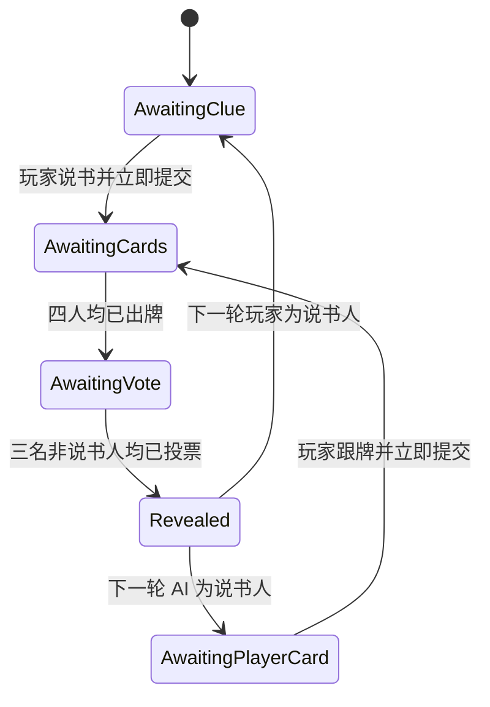

# DreamCards 系统设计文档

> 文档定位：用于说明玩法规则、系统结构和关键设计决策  
> 目标读者：游戏策划、系统策划、制作人、面试官  
> 版本：Demo 0.1 / 2026-06-08

## 1. 产品概述

DreamCards 是一款四人图片联想叙事游戏。每轮由一名说书人选择图片并给出提示，其他玩家提交具有相似联想的图片，随后非说书人猜测哪张图片属于说书人。

项目不以胜负竞争为唯一目标，而是尝试解决三个体验问题：

1. 图片如何持续产生新的解释，而不是被名称和标签限定？
2. 一局结束后，玩家为什么还愿意继续创作、发现与交流？
3. AI 如何参与主观联想，而不退化为随机选择器？

## 2. 设计支柱

### 图片是唯一的一手信息

对局中禁止展示：

- 卡牌名称
- 标签
- 创作者
- 作品编号
- 收藏量、出场量

这些信息会提前建立语义锚点，使玩家从“观察图片”变成“匹配文字”。因此对局阶段只保留图片，作品身份与历史在结算后或图鉴中展示。

### 故事比排名重要

分数负责维持规则张力，但产品价值来自：

- 为什么某张图让玩家想到这个提示？
- 为什么有人被另一张图误导？
- 说书人原本还考虑过哪些提示？

因此系统保留灵感草稿、回合档案和复盘室，避免结算页变成纯数值页面。

### 围桌空间必须稳定

玩家固定处于底部，三名对手位于上、左、右。阶段变化只改变桌上的内容和玩家状态，不切换到多个独立页面，降低空间认知成本。

## 3. 用户类型与需求

| 用户 | 核心需求 | 系统回应 |
|---|---|---|
| 初次玩家 | 快速理解规则并开始游戏 | 默认梦境集、单人 AI 模式、阶段状态 |
| 表达型玩家 | 记录自己的联想 | 卡牌级灵感草稿与备注 |
| 收藏型玩家 | 持续发现内容 | 图鉴、收藏、发现时间 |
| 创作者 | 作品被认可并保留来源 | 永久创作者署名与个人作品序号 |
| 策展型玩家 | 整理主题内容 | 10 张作品组成梦境集 |
| 社交型玩家 | 讨论不同解释 | 回合档案与复盘室 |

## 4. 核心循环

### 单局循环

`选择梦境集 → 说书 → 跟牌 → 匿名展示 → 投票 → 计分 → 补牌 → 轮换说书人`

### 长期循环

`创作作品 → 被发现 → 被收藏 → 加入梦境集 → 进入对局 → 产生联想与故事 → 提升作品传播`

长期循环的设计目的，是让对局成为内容传播器，而不是与社区系统相互独立的小游戏。

## 5. 回合规则

### 5.1 开局

- 固定四名玩家。
- 每名玩家携带 10 张作品。
- 四套梦境集必须分配为 40 张不重复作品。
- 每人初始抽取 6 张手牌，其余进入个人抽牌堆。

### 5.2 说书

- 每轮一名玩家为说书人。
- 说书人选择一张手牌并给出提示。
- 提示可以是词语、短句、情绪或隐喻。
- 说书人的目标不是让所有人猜中，而是让部分玩家猜中。

### 5.3 跟牌

- 其他三名玩家各提交一张手牌。
- 已提交玩家在桌前出现统一牌背。
- 牌背不显示说书人标记，避免泄露答案。
- 提交的牌立即从手牌移入个人弃牌堆。

### 5.4 匿名展示与投票

- 四张图片随机排列。
- 不显示 A/B/C/D、提交者、创作者和作品编号。
- 说书人不投票。
- 非说书人不能投自己的牌。
- 投票完成状态公开，投票目标在揭晓前保密。

### 5.5 计分

设非说书人数为 3，猜中说书人图片的人数为 `C`。

| 条件 | 说书人 | 猜中者 | 未猜中者 |
|---|---:|---:|---:|
| `C = 0` | 0 | 不适用 | +2 |
| `C = 3` | 0 | +2 | 不适用 |
| `0 < C < 3` | +3 | +3 | 0 |

额外规则：

- 非说书人的图片每获得一票，其提交者额外获得 1 分。
- 玩家不得从自己提交的图片获得自投分。

这套计分同时奖励：

- 说书人控制提示的模糊度。
- 猜测者识别说书人的表达。
- 跟牌者使用图片制造合理干扰。

### 5.6 回合结束

- 展示图片归属、投票关系和本轮得分。
- 已使用作品计入出场次数，并加入玩家发现记录。
- 所有人从个人抽牌堆补至 6 张。
- 抽牌堆耗尽时，洗混个人弃牌堆形成新抽牌堆。
- 说书人按固定顺序轮换。

## 6. 实时状态机

### 6.1 状态定义



### 6.2 为什么需要 `AwaitingCards`

早期版本中，玩家提交提示后，接口会等待三名 AI 全部选牌才返回。结果是：

- 玩家自己的出牌状态无法立即显示。
- 一个慢模型会让所有玩家看起来都没有行动。
- 重复点击风险增加。
- 实时牌桌变成同步表单。

加入 `AwaitingCards` 后：

- 玩家提交在本地和服务端立即生效。
- AI 各自执行后台任务。
- 每完成一个 AI，就立即增加对应提交记录。
- 前端通过短轮询同步状态。

### 6.3 公开信息与私密信息

| 阶段 | 可公开 | 必须隐藏 |
|---|---|---|
| 手牌 | 自己的图片 | 他人手牌 |
| 出牌中 | 谁已出牌 | 出了哪张 |
| 投票中 | 谁已投票 | 投给哪张 |
| 揭晓后 | 图片归属、投票流向、得分 | 后台标签 |
| 复盘 | 主动公开的灵感与备注 | 未公开私人草稿 |

这是系统策划中的权限矩阵。信息展示错误会直接破坏推理公平性。

## 7. AI 玩家系统

### 7.1 AI 角色

| 玩家 | 模型 | 作用 |
|---|---|---|
| AI_Alice | GPT-4.1 mini Vision | 视觉理解与联想 |
| AI_Bob | Mistral Small 3.1 Vision | 视觉理解与联想 |
| AI_Carol | Phi-4 Multimodal | 视觉理解与联想 |

使用不同模型的目的不是制造数值差异，而是观察不同模型是否形成不同的联想风格。

### 7.2 说书行为

输入：

- 说书人选中的图片

目标：

- 生成 2–10 个汉字的中文提示。
- 不直接说出主体、物体、人物、动物、地点、颜色、数量或明显动作。
- 优先使用情绪、记忆、隐喻、反差和时间感。
- 设计目标为三名猜测者中约 1–2 人猜中。

### 7.3 跟牌行为

输入：

- 提示词
- AI 的手牌图片

目标：

- 选择存在合理联系、但不完全直白的图片。
- 只使用图片内容，不使用创作者和编号。

### 7.4 投票行为

输入：

- 提示词
- 匿名候选图片
- 自己提交的卡牌 ID

约束：

- 排除自己的图片。
- 选择最可能属于说书人的图片。
- 揭晓前只公开“已投票”，不公开投票目标。

### 7.5 容错与服务质量

任何外部模型都不能成为对局的单点故障。

| 异常 | 系统处理 |
|---|---|
| 无 API Key | 本地策略 |
| 请求失败或限流 | 本地策略 |
| 超过 9 秒 | 本地策略 |
| JSON 无法解析 | 尝试提取 JSON，失败则降级 |
| 返回不存在的卡牌 | 从有效候选中降级选择 |
| 图片读取失败 | 当前 AI 降级，不中断其他 AI |

AI 的失败粒度是“单个玩家的一次行为”，不是“整个回合”。

## 8. 卡牌与内容系统

### 8.1 卡牌身份

卡牌不使用标题，核心字段为：

```json
{
  "cardId": "card_x9ab21",
  "creatorId": 1,
  "creatorName": "Alice",
  "creatorSequence": 7,
  "imageUrl": "/uploads/card_x9ab21.png",
  "createdAt": "2026-06-05T12:00:00.000Z",
  "timesPlayed": 123,
  "timesCollected": 45
}
```

展示身份为 `Alice#7`。序号由系统按创作者独立生成，不可修改。

### 8.2 为什么永久保留创作者

图片会被收藏、加入其他玩家的梦境集并带入对局，但传播不应抹除来源。永久署名同时提供：

- 创作者认可
- 内容追溯
- 后续声望系统的数据基础
- 社区内容生态的责任归属

### 8.3 图鉴、收藏与梦境集

- 图鉴回答“我见过什么”。
- 收藏回答“我喜欢什么”。
- 梦境集回答“我想如何组织和表达这些作品”。

梦境集不是竞技套牌，而是策展单元，因此包含封面、名称、简介、创建时间与作品陈列。

## 9. 灵感与复盘系统

### 9.1 灵感草稿

- 草稿绑定具体卡牌。
- 玩家任何时候都可以提前记录。
- 每条灵感可附加备注。
- 对局中其他玩家只看到创作状态，不看到内容。

### 9.2 回合记忆

每轮保存：

```text
roundId
clue
storyteller
winner
cards
votes
scoreDelta
scores
privateInspirations
sharedInspirations
```

### 9.3 复盘价值

复盘不是模型调试页，而是解释差异的社交空间：

- 最终用了什么提示？
- 哪些灵感没有采用？
- 谁被哪张图片误导？
- 玩家是否愿意公开自己的创作过程？

## 10. 关键设计决策

### 决策一：取消标题，而不是隐藏标题

如果数据结构仍以标题为核心，标题很容易在搜索、接口或组件中重新泄露。彻底取消标题，能让系统层面与产品原则一致。

### 决策二：作品身份只在对局外展示

创作者署名与匿名联想并不冲突，关键是按阶段控制信息。对局内保护开放解释，对局外保护创作者权益。

### 决策三：玩家状态必须逐人更新

实时桌游的反馈单位应该是玩家行为，而不是接口请求。谁完成，谁立即产生桌面反馈。

### 决策四：AI 必须有硬超时

“自动 fallback”只有在请求能够结束时才有效。没有硬超时的 fallback 不是可靠容错，因此加入 9 秒上限。

### 决策五：分数是反馈，不是视觉中心

分数用于解释规则结果，但图片、提示和玩家关系拥有更高视觉优先级。

## 11. 后续规划

### P0：可稳定展示

- 断线后恢复当前单人回合。
- 完整自动化关键路径测试。
- 替换剩余临时图片资产。

### P1：真实多人

- WebSocket 房间同步。
- 玩家准备、掉线托管与重连。
- 服务端权威计时与防重复提交。

### P2：内容生态

- 图片审核与举报。
- 主题推荐和梦境集收藏。
- 创作者声望与作品传播路径。

### P3：数据验证

- 提示猜中率分布。
- 单轮思考时长。
- 收藏转化率。
- 对局后复盘进入率。
- 作品被带入对局后的二次收藏率。

